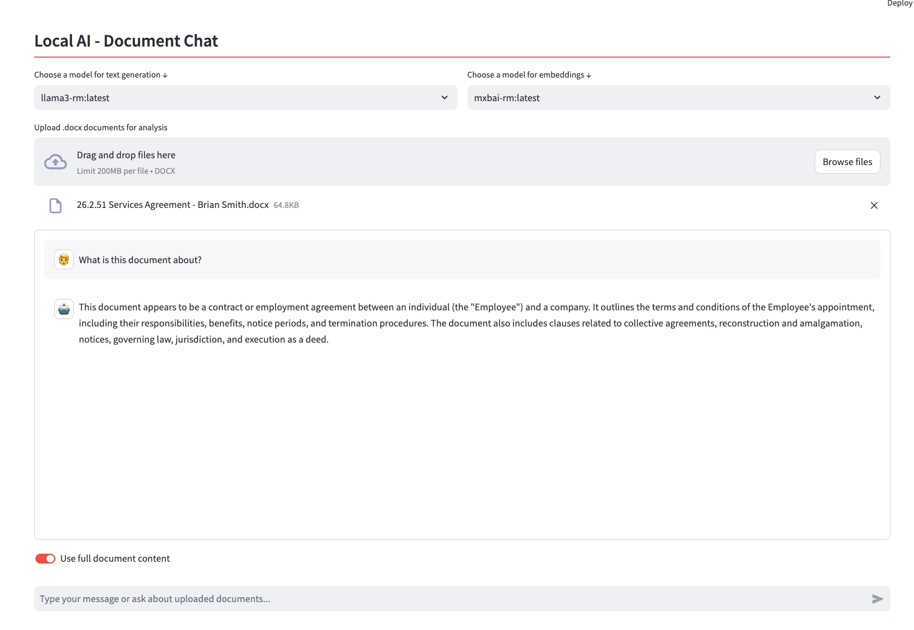

# Local Legal AI Chatbot



## Overview

The Local Legal AI Chatbot is an example application that combines the power of local AI models with an intuitive user interface to assist with legal document analysis and general AI-powered chat interactions. By leveraging [Ollama](https://ollama.com/) for local model execution and [Streamlit](https://streamlit.io) for the frontend, this project offers a seamless and private solution for legal professionals and enthusiasts.

This is not for use in production, there's lots of nuance around AI - howwever you can start to look at the basics of using Local AI with this.

## Key Features

- **Local Model Execution**: Run AI models directly on your machine, ensuring data privacy and reducing reliance on external APIs.
- **User-Friendly Interface**: Built with Streamlit, offering an intuitive and responsive user experience.
- **Capabilities**:
  - **Chat Page**: General AI chatbot for versatile interactions.
  - **Document Page**: Specialised interface for legal document analysis with context from uploaded files.
- **Flexible Document Analysis**: Toggle between full document context and embedding-based similarity search for optimal results.
- **Support for Multiple Models**: Choose from a range of Ollama-compatible models to suit your specific needs.

## Recommended Models

Before running the application, we recommend downloading the following models using Ollama:

1. For text generation (LLM):
   - `phi3:medium`: A balanced model suitable for most tasks.
   - `llama3`: A more powerful model for complex reasoning tasks.

2. For embeddings:
   - `nomic-embed-text`: Optimised for creating text embeddings.

To download these models, use the following commands:

```bash
ollama pull phi3:medium
ollama pull llama3
ollama pull nomic-embed-text
```

## Setup and Installation

### Prerequisites

- [Ollama](https://ollama.com/) installed on your system
- Python 3.7 or higher

### Installation Steps

1. Clone the repository:
   ```bash
   git clone https://github.com/ryanmcdonough/local-ai-legal.git
   cd local-legal-ai-chatbot
   ```


2. Install required packages:
   ```bash
   pip install -r requirements.txt
   ```

## Usage

1. Start the application:
   ```bash
   streamlit run Talk.py
   ```

2. Open the provided URL in your web browser.

### Chat Page

- Select your preferred text generation model.
- Engage in open-ended conversations with the AI.

### Document Page

1. Choose models for text generation and embeddings.
2. Upload your .docx legal documents.
3. Use the chat interface to ask questions about the uploaded documents.
4. Toggle "Use full document content" to switch between:
   - OFF: Embedding-based similarity search (better for specific questions)
   - ON: Full document context (comprehensive analysis, may be slower)

## Contributing

We welcome contributions to improve the Local Legal AI Chatbot! Here's how you can help:

- **Report Bugs**: Open an issue describing the bug and how to reproduce it.
- **Suggest Enhancements**: Have ideas for new features? We'd love to hear them!
- **Submit Pull Requests**: Feel free to fork the repository and submit PRs for bug fixes or new features.

## License

This project is licensed under the MIT License. See the [LICENSE](LICENSE) file for details.

## Support

If you encounter any issues or have questions, please open an issue on the GitHub repository. Happy to take a look at any problems.
